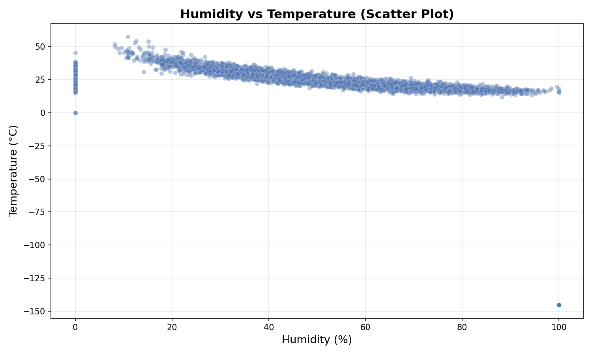
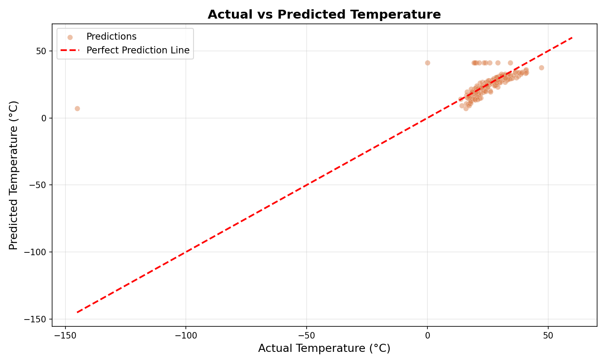

# Temperature Prediction
Predict temperature from humidity using a simple, explainable linear regression baseline.

## Project Highlights
- Clean, single-notebook workflow (load, explore, train, evaluate)
- Simple baseline model you can improve with more features or models
- Visual outputs included for quick insight

## Dataset
The dataset contains sensor readings with the following fields:
- `sensor_id`, `lat`, `lon`, `pressure`, `temperature`, `humidity`

## Method
1. Load and inspect the data
2. Explore humidity vs temperature relationships
3. Train a linear regression model
4. Evaluate with MSE, RMSE, and $R^2$

## Results Preview

## Project Structure
- Temperature Prediction_Test.ipynb
- humidity.csv
- plot_scatter.png
- plot_actual_vs_pred.png

## Run Locally
1. Open the notebook: `Temperature Prediction_Test.ipynb`
2. Run all cells in order

## Next Steps
- Add more features (pressure, latitude, longitude)
- Try polynomial regression or tree-based models
- Track metrics across experiments
